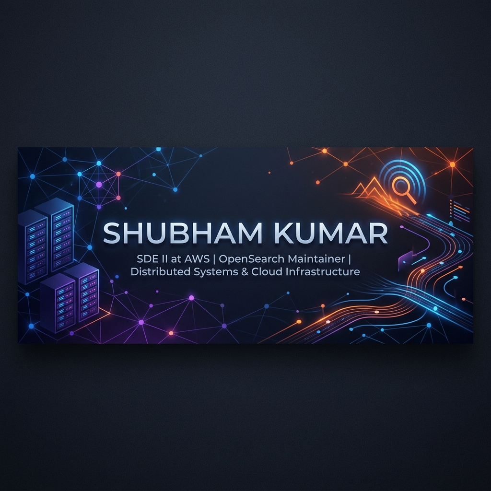

# Shubham Kumar

<!-- Banner -->

 

### SDE II @ AWS | OpenSearch Storage Encryption Maintainer | Distributed Systems Enthusiast

  
  
  
  

---

## 💼 About Me

- 🚀 **Software Development Engineer II** at **Amazon Web Services (AWS)**, focusing on search, storage, and analytics systems within the **OpenSearch** ecosystem.
- 🔐 **Maintainer** of **OpenSearch Storage Encryption**, ensuring security at rest for high-throughput search infrastructure.
- 🏢 Former **Software Engineer** at **Samsung**, where I engineered large-scale software systems and product features.
- 🎓 Alumnus of the **National Institute of Technology (NIT), Patna**.
- 💡 Deeply interested in distributed systems design, data security, cloud infrastructure, and search technologies.

---

## 🎯 Core Focus Areas
- 🌐 Distributed Systems & Search Infrastructure
- ☁️ Cloud Computing & Backend Engineering
- 🔒 Data Security & System Design
- 🛠️ Developer Productivity Tools

---

## 🛠️ Technical Skills

<table>
  <tr>
    <td valign="top" width="50%">
      <h3>💻 Languages</h3>
      
      
      
      
        
      <h3>⚡ Backend & Distributed Systems</h3>
      
      
      
      
    </td>
    <td valign="top" width="50%">
      <h3>☁️ Cloud & Infrastructure</h3>
      
      
      
      
        
      <h3>🔍 Search & Databases</h3>
      
      
      
      
      
    </td>
  </tr>
</table>

---

## 💼 Professional Experience

#### **Amazon Web Services (AWS)** | *Software Development Engineer II*
> Working on search and analytics technologies through OpenSearch.

#### **Samsung** | *Software Engineer*
> Worked on large-scale software systems and product engineering.

---

## 🎓 Education

#### **National Institute of Technology (NIT) Patna**
> Bachelor of Technology (B.Tech)

---

## 🌟 Featured Projects

### 🌐 [Portfolio Website](https://shubhamkrshandilya.github.io)
A premium personal website showcasing professional experience, patent portfolio, key projects, and achievements.

### 🩺 Repo Doctor
An AI-powered repository analysis platform that focuses on enhancing repository health, identifying code quality issues, and boosting developer productivity.

### 📦 Open Source Contributions
Active maintenance and contributions across various repositories in the OpenSearch ecosystem, specifically focusing on storage encryption and performance characteristics.

---

## 🔬 Patents & Innovation

I am actively involved in patent-related research and innovation in my domains. 
You can view detailed descriptions of my patent filings and innovations on my website:
➡️ **[Patents Portfolio](https://shubhamkrshandilya.github.io/#patents)**

---

## 📈 GitHub Stats

  <table border="0">
    <tr>
      <td>
        
      </td>
      <td>
        
      </td>
    </tr>
  </table>

---

## 💭 Philosophy

> *Build systems that are simple to operate, scalable by design, and reliable under failure.*
